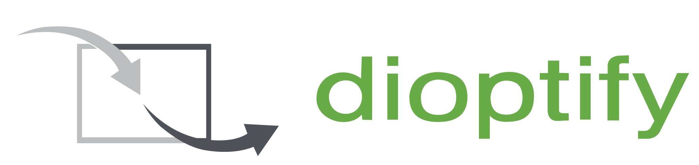

# Hello there! 

I'm **Kevin** — an `{R&D}` engineer and entrepreneur based in Northern Germany.
Founder of , building at the intersection of **Machine Learning**, **Computer Vision**, and **custom software**.

I ship open-source repos here regularly — feel free to dig around, fork anything, or reach out.

📫 Let's talk: [kevin@peivareh.com](mailto:kevin@peivareh.com) &nbsp;·&nbsp; 🌐 [birkenpapier.github.io](https://birkenpapier.github.io)

 

## 🛠️ Tech Stack

 

## 🚀 Featured Projects

| Project | What it is |
| --- | --- |
| 🎨 **[dioptify](https://dioptify.com)** | AI-powered image generation platform — your visual imagination, scaled. |
| 💼 **[servicelead](https://github.com/Birkenpapier)** | Software agency for AI, ML & Computer Vision solutions. |
| 🔌 **[7400_NN](https://github.com/Birkenpapier/7400_NN)** | Neural network simulation of the classic 7400 logic chip. |
| 📦 **[MDK Logistik](https://github.com/Birkenpapier)** | Full website & tooling for a logistics company. |

 

## 📈 GitHub Stats

  

 

## 🤝 Open to Collaboration

I'm always happy to talk about:
- 🤖 Machine Learning & Computer Vision projects
- 🧩 Custom software & automation
- 🧪 R&D experiments with no clear deadline
- ☕ Coffee, if you're in Hannover

If you're searching for purpose — or just a good engineer — [drop me a line](mailto:kevin@peivareh.com).

 

<!-- Cute Dog stays. Always. -->

may this dog bless your day → 

